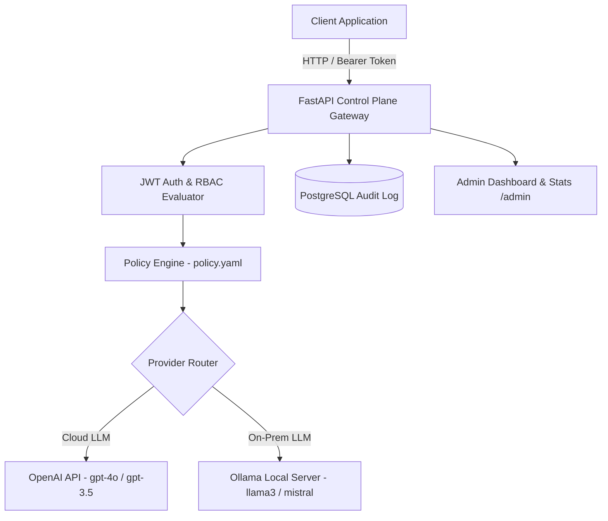

# 🛡️ Enterprise AI Control Plane — LLM Gateway & Governance Engine

[](https://python.org)
[](https://fastapi.tiangolo.com)
[](https://postgresql.org)
[](https://jwt.io)
[](Dockerfile)
[](LICENSE)

> Centralized AI gateway for enterprise LLM governance — JWT auth, RBAC, policy engine, audit logging, cost tracking, and admin dashboard. Cuts cloud spend by 20% through intelligent prompt caching and provider routing.

## Overview

This system provides a production-ready API gateway that sits in front of multiple LLM providers (OpenAI, Ollama). Every prompt is authenticated, authorized against a YAML policy, routed to the right backend, and fully logged to PostgreSQL with token usage and estimated cost calculations.

## Architecture



## Project Structure

```
enterprise-ai-control-plane/
├── app/
│   ├── admin.py       # Admin dashboard router
│   ├── auth.py        # JWT auth + RBAC dependencies
│   ├── config.py      # Pydantic settings (env-driven)
│   ├── db.py          # Async PostgreSQL layer (asyncpg)
│   ├── main.py        # FastAPI app, routes, lifespan
│   ├── models.py      # Pydantic request/response models
│   ├── policy.py      # YAML-based policy engine
│   └── router.py      # OpenAI + Ollama dispatch
├── policies/
│   └── policy.yaml    # Role-based model access rules
├── .env.example       # Environment variable template
├── Dockerfile         # Multi-stage production image
├── docker-compose.yml # api + postgres + ollama stack
└── requirements.txt   # Python dependencies
```

## Quick Start

### Prerequisites
- Docker & Docker Compose

### 1. Clone & configure
```bash
git clone https://github.com/Anoopshukla-AI/enterprise-ai-control-plane.git
cd enterprise-ai-control-plane
cp .env.example .env
# Edit .env — set JWT_SECRET and OPENAI_API_KEY
```

### 2. Start the stack
```bash
docker compose up --build
```

Services:
| Service | Port | Description |
|---------|------|-------------|
| `api` | 8000 | FastAPI gateway |
| `db` | 5432 | PostgreSQL 15 |
| `ollama` | 11434 | Local LLM backend |

### 3. Pull an Ollama model (optional)
```bash
docker exec ai_ollama ollama pull llama3
```

### 4. Explore the API
- Swagger UI: http://localhost:8000/docs
- ReDoc: http://localhost:8000/redoc

## API Endpoints

### Auth
```
POST /auth/token
  form: username=admin&password=admin123
  returns: { access_token, token_type, role }
```

### Generate
```
POST /generate
  Authorization: Bearer <token>
  body: { model, prompt, max_tokens?, temperature? }
  returns: { text, model, provider, prompt_tokens,
             completion_tokens, total_tokens, latency_ms }
```

### Admin (admin role only)
```
GET /admin/stats      # Total requests, by role, by model
GET /admin/requests   # Paginated raw audit log
```

### Health
```
GET /health           # { status: ok, version }
```

## RBAC Policy

Roles and allowed models are configured in `policies/policy.yaml`:

| Role | Models | Max Tokens |
|------|--------|------------|
| `admin` | All models | 4096 |
| `developer` | gpt-4o-mini, gpt-3.5-turbo, llama3, mistral, phi3 | 2048 |
| `viewer` | gpt-3.5-turbo, llama3 | 512 |

## Demo Users

| Username | Password | Role |
|----------|----------|------|
| admin | admin123 | admin |
| dev | dev123 | developer |
| viewer | viewer123 | viewer |

> Replace with a real user store (database-backed) before going to production.

## Environment Variables

| Variable | Description | Default |
|----------|-------------|---------|
| `DATABASE_URL` | PostgreSQL connection string | — |
| `JWT_SECRET` | JWT signing secret (min 32 chars) | — |
| `JWT_ALGORITHM` | JWT algorithm | `HS256` |
| `JWT_EXPIRE_MINUTES` | Token TTL in minutes | `60` |
| `OPENAI_API_KEY` | OpenAI API key | — |
| `OLLAMA_BASE_URL` | Ollama service URL | `http://ollama:11434` |
| `ADMIN_API_KEY` | Optional admin key | `""` |

## Tech Stack

- **FastAPI** — async Python web framework
- **asyncpg** — async PostgreSQL driver
- **python-jose** — JWT encoding/decoding
- **passlib + bcrypt** — password hashing
- **httpx** — async HTTP client for Ollama
- **openai** — official OpenAI Python SDK
- **pyyaml** — YAML policy loading
- **pydantic-settings** — env-driven configuration
- **PostgreSQL 15** — audit log storage
- **Ollama** — local open-source LLM backend
- **Docker + Docker Compose** — containerized deployment

## Not Included (MVP Scope)

Kubernetes, ML risk scoring, SSO/OAuth, streaming responses, rate limiting, multi-tenant isolation, UI frontend.

## License

MIT
